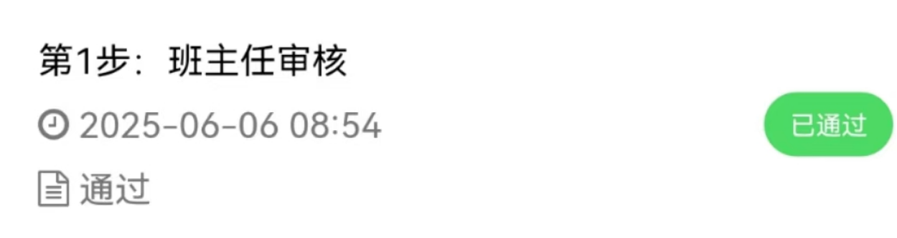
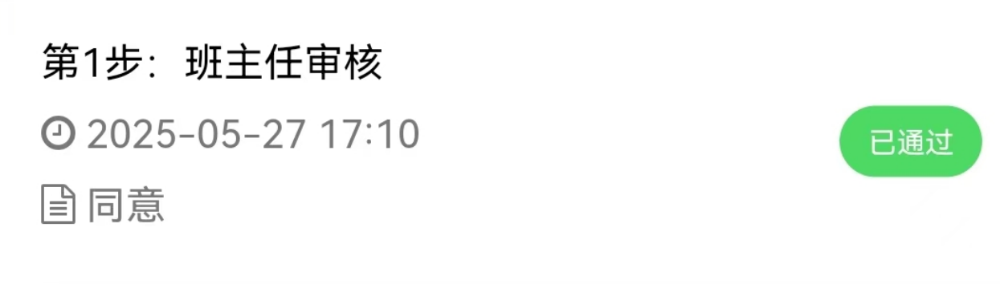

# hnie-forge-leave-tips

---

> 账号学号，密码默认是 `HNIE@身份证后六位`

---


## 前言：

    原仓库中`headmasterApproveReason`默认值为"通过"， 而实际应为"同意"





## 安装依赖

如需打包， 请在项目根目录下依次执行以下命令，安装项目所需依赖(开发可clone development分支)：

```bash
npm install uview-ui

npm install uview-ui lodash-es dayjs json-stringify-pretty-compact
```

并在 `manifest.json`的 `"appid"`中修改为自己的Appid

---


## ⚠️ 免责声明

* 本代码遵循 [GPL-3.0 License](https://github.com/Samueli924/chaoxing/blob/main/LICENSE) 协议，允许 **开源/免费使用和引用/修改/衍生代码的开源/免费使用** ，不允许 **修改和衍生的代码作为闭源的商业软件发布和销售** ，禁止 **使用本代码盈利** ，以此代码为基础的程序**必须**同样遵守 [GPL-3.0 License](https://github.com/Samueli924/chaoxing/blob/main/LICENSE) 协议
* 本代码仅用于 **学习讨论** ，禁止**用于盈利**
* 他人或组织使用本代码进行的任何**违法行为**与本人无关
